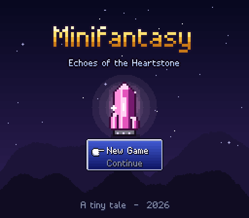
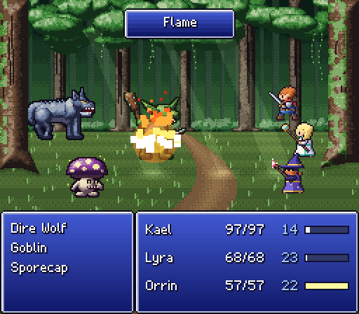
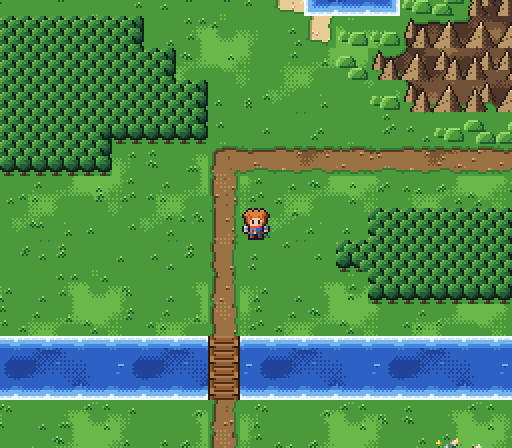
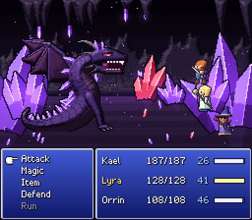

# Minifantasy: Echoes of the Heartstone

A tiny 16-bit style JRPG that runs in your browser. The world is small, but the game is complete: an overworld, a village with a shop and an inn, a two-floor dungeon, a mini-boss, a final boss, and an ending.

**▶ Play it here: https://mattias800.github.io/minifantasy/**

| | |
|---|---|
|  |  |
|  |  |

## The story

A fallen star, the **Heartstone**, has kept the isle of Lumen warm and peaceful for a thousand years. Now its light is fading. Kael the knight, Lyra the cleric and Orrin the arcanist must pass through the **Hollow Grotto** and find out what is draining it.

## Features

- **Side-view battles on active time gauges** (in "wait" mode: time pauses while you choose a command). Attack, Skills/Magic, Items, Defend and Run.
- **Party of three**, each with their own abilities learned by level. The Knight has sword skills, the Cleric has healing and holy magic, the Arcanist has elemental magic.
- **Elemental weaknesses and resistances.** Undead are hurt by healing. There is also poison, Barrier and Defend.
- **Levels, EXP, gold, drops and equipment.** Weapons and armor come from the armory or from chests.
- **Random encounters** that change with the region, plus two boss fights with scripted cutscenes.
- **Field menu** with Items, Magic, Equip, Status and Save, in the classic blue windows.
- **Saving** on the world map or at save crystals. Saves are kept in your browser's localStorage.
- **All original content.** Every sprite, tile, monster, background, font glyph, song and sound effect is generated in code at runtime. The repo contains no image or audio files, except the README screenshots.

## Controls

| Action | Keyboard | Gamepad |
|---|---|---|
| Move | Arrow keys / WASD | D-pad / left stick |
| Confirm / talk | Z, Enter, Space | A |
| Cancel / open menu | X, Esc, Backspace | B |
| Menu | C, Tab | Y / Start |
| Dash | Shift | X |
| Mute | M | |
| Fullscreen | F | |

## Running locally

```bash
npm install
npm run dev        # http://localhost:5173
npm test           # unit tests (rules, balance simulation, music, font)
npm run build      # production build in dist/
```

In dev builds you can use URL shortcuts to jump anywhere. Some examples:

- `?start=cave1,14,20&level=6`
- `?battle=troll&bg=cave&boss=1&level=7`
- `?scene=ending`

See `src/debug.ts` for the full list. There are also preview pages for the asset generators at `/dev/tiles.html`, `/dev/characters.html`, `/dev/enemies.html`, `/dev/audio.html` and `/dev/font.html`.

## Architecture

TypeScript, Vite and plain Canvas 2D at the SNES resolution of 256×224, upscaled with nearest-neighbour. There is no game engine or runtime dependency.

```
src/
  engine/     Game loop & scene stack, input (keyboard + gamepad), bitmap font, math helpers
  gfx/        Procedural pixel art: tiles, characters, monsters, battle backgrounds
  audio/      Web Audio synth, sequencer, song notation, all tracks & SFX
  data/       Game content: items, spells, enemies, party classes, shops, maps (ASCII + scripts)
  game/       Persistent state: party members, inventory, save/load
  field/      Map exploration, actors, and the async script API used by map events
  battle/     Battle rules (pure & tested), battle scene, visual effects, balance simulator
  scenes/     Title, intro, field menu, shop, game over, ending, transitions
  ui/         Windows, menus, message boxes, logo rendering
```

Some design choices that make the game easy to extend:

- **Scenes return results.** `await game.run(new MessageScene(...))` pushes a scene and resolves when it finishes. Map events are plain async functions:

  ```ts
  talk: async (s) => {
    await s.say('The Grotto lies north-east.', 'Elder Maren');
    if (await s.battle(['troll'], { boss: true })) s.state.setFlag('troll_defeated');
  }
  ```

- **Maps are ASCII grids** with a legend, plus NPCs, warps, chests, triggers and encounter tables (`src/data/maps/`). Tiles autotile against their neighbours when they are drawn.
- **Battle rules are separate from rendering** (`src/battle/rules.ts`). `src/battle/simulate.ts` plays thousands of fights headlessly. `balance.test.ts` fails if the bosses become trivial or impossible at the expected levels.
- **Songs are text.** Each channel is a string in a small notation such as `"E5:8 G5:8 B5:4 | ..."`. Adding a track means adding one file (`src/audio/tracks/`). Tests check that every channel loops at the same length and that the notes stay in key.

## License

MIT. This is a fan-made homage to the 16-bit JRPGs of the 90s. It is not affiliated with any publisher, and all of its content is original.
